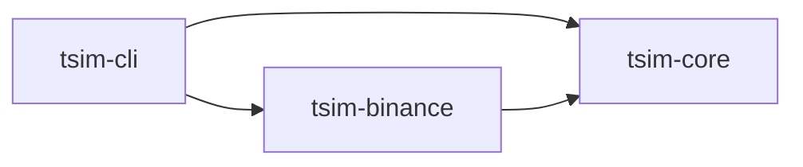
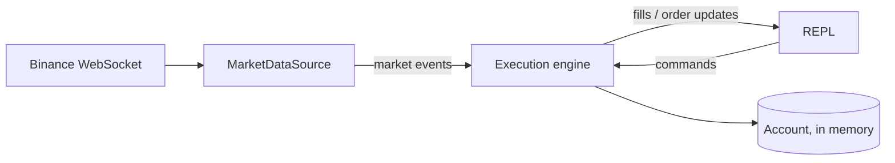

# Architecture

High-level view of the system. Rationale for each choice lives in the
Architecture Decision Records (ADR) under [`docs/adr/`](docs/adr/); detailed per-feature designs
live under [`docs/design/`](docs/design/). This document is updated at the end of each milestone.

## Crates

| Crate          | Role |
|----------------|------|
| `tsim-core`    | Domain types (`Price`, `Qty`, orders, account), simulated execution engine, `MarketDataSource` and clock abstractions. No network or file I/O. |
| `tsim-binance` | Binance adapter implementing `MarketDataSource` (trades, Level 2 order book). |
| `tsim-cli`     | `tsim` binary: configuration, wiring, read-eval-print loop (REPL). |

## Data flow (target for v0.1.0)

The engine runs in the library crate and communicates through `tokio` channels: commands in,
events out. The same engine and `Strategy` interface will drive historical replay, with the market
data source and the clock swapped for deterministic implementations.

## Milestones

_Filled in as milestones are delivered._
